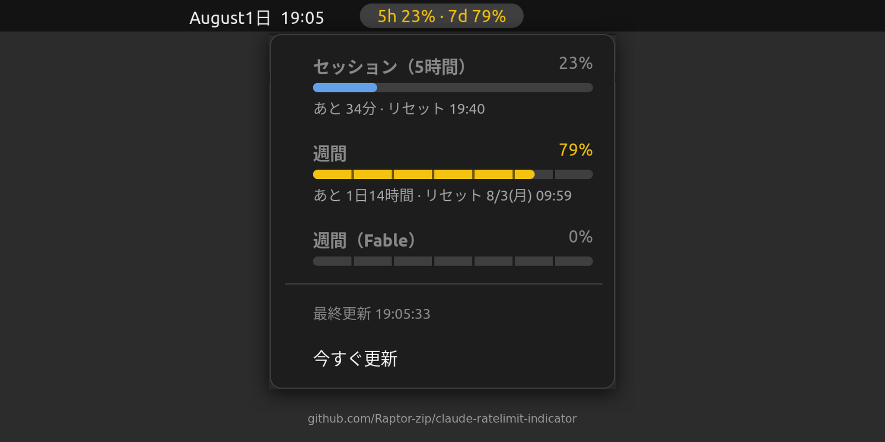

# AI Rate Limit — GNOME Shell indicator

Shows your AI CLI usage limits — the 5-hour session window and the weekly window —
right next to the clock in the GNOME top bar. Supported tools:

- **Claude** (Claude Code)
- **Codex** (OpenAI Codex CLI, ChatGPT sign-in)
- **Kimi** (Kimi Code CLI)
- **AGY** (Google Antigravity)



All tools share a single panel item: a compact per-tool summary like
`Cl 51/99  Cx 100/16  Km 41/13  Ag 1/0` (5h % / weekly %; tools with no cache yet are
omitted). Click it for a menu with a section per tool: usage bars, time until reset, and
per-model/per-group scopes. The weekly bar is divided into 7 segments so you can see at a
glance whether you are ahead of or behind a one-day-per-segment pace.

## How it works

| Path | Role |
|---|---|
| `bin/ai-usage-fetch.py` | Calls each provider's usage endpoint and writes the caches |
| `systemd/ai-usage.{service,timer}` | Runs the fetcher every 2 minutes |
| `extension/ai-ratelimit@raptor-zip.github.io/` | Reads the caches and draws the indicators |
| `~/.cache/ai-usage/<provider>.json` | The cache that connects the two |

One cache file per provider (`claude.json`, `codex.json`, `kimi.json`, `agy.json`).
Keeping the network work in a separate process means the GNOME Shell main loop is never
blocked by an HTTP request.

Where the usage data comes from:

| Provider | Credentials | Endpoint |
|---|---|---|
| Claude | `~/.claude/.credentials.json` (OAuth access token) | `GET https://api.anthropic.com/api/oauth/usage` |
| Codex | `~/.codex/auth.json` (`tokens.access_token` + `tokens.account_id`) | `GET https://chatgpt.com/backend-api/wham/usage` |
| Kimi | newest `~/.kimi-code/credentials/kimi-code*.json` | `GET https://api.kimi.com/coding/v1/usages` |
| AGY | GNOME keyring item `{service: gemini, username: antigravity}` | `POST https://daily-cloudcode-pa.googleapis.com/v1internal:retrieveUserQuotaSummary` |

**Token refresh policy.** Claude, Codex and AGY tokens are never refreshed by the
fetcher — rotating someone else's refresh token could break the CLI's own session, so on
an expired token or a 401 the panel dims and the menu explains why. Starting the tool
once refreshes its token and the indicator recovers. **Kimi is the exception**: its
access tokens live only 15 minutes, so the fetcher refreshes them via
`https://auth.kimi.com/api/oauth/token` (public client) and atomically writes the
rotated tokens back to the same `kimi-code*.json` file so the CLI keeps working.

**Multiple Kimi accounts.** The CLI stores credentials per environment as
`kimi-code-env-<hash>.json`. The fetcher reads every `kimi-code*.json` file and shows
each account as its own cell (`Kimi`, `Kimi (…xxxx)`, …) and panel entry (`K1`, `K2`).
Accounts sharing one credential file (same environment) are a single entry — a second
account only appears separately once it has its own credentials file.

## Requirements

- GNOME Shell 42 (tested on Ubuntu 22.04, X11).
  43 and 44 will most likely work — add the version to `shell-version` in
  `metadata.json` and try it. GNOME 45+ needs an ESM port and is not supported yet.
- Python 3.10+ (standard library only)
- For **AGY**: `python3-secretstorage` (to read the token from the GNOME keyring) and an
  unlocked login keyring. Without it the other three providers still work.
- Each tool signed in with its subscription:
  - Claude Code with a Claude subscription (OAuth; API-key-only setups have no usage endpoint)
  - Codex CLI signed in with a ChatGPT account
  - Kimi Code CLI logged in (`/login`)
  - Antigravity logged in

## Install

```bash
git clone https://github.com/Raptor-zip/ai-ratelimit-indicator.git
cd ai-ratelimit-indicator
./install.sh
```

Then activate it:

1. Restart GNOME Shell — `Alt+F2` → `r` → `Enter` (X11 only; on Wayland, log out and back in)
2. `gnome-extensions enable ai-ratelimit@raptor-zip.github.io`

Uninstall with `./install.sh uninstall`.

## What you get

- **Panel** (single item): `Cl 51/99  Cx 100/16  …` — per-tool 5h % / weekly %
  - Yellow at 60%, bold red at 85% (based on the worst value)
  - Dimmed when the cache is more than 15 minutes old — your cue that the timer stopped
    or the network is down
  - Tools with no cache yet are omitted
- **Menu** (compact 2×2 grid, one cell per tool):
  - 5h / 7d usage bars with reset countdowns; the 7d bar has 7 division marks (one per day)
  - Per-model/per-group scopes when the provider reports any
    (Claude: per-model weekly scopes; AGY: the Claude/GPT model group's 5h and 7d buckets)
  - Last-updated time and a **Refresh now** button (opening the menu also triggers a fetch)

## Configuration

Change the polling interval by editing `OnUnitInactiveSec` in
`~/.config/systemd/user/ai-usage.timer`, then:

```bash
systemctl --user daemon-reload && systemctl --user restart ai-usage.timer
```

Thresholds (`WARN_PCT` / `CRIT_PCT`), the stale cutoff (`STALE_SECONDS`) and the
provider list (`PROVIDERS`) are constants at the top of `extension.js`.

## Troubleshooting

```bash
~/.local/bin/ai-usage-fetch                       # fetch all providers, print the results
~/.local/bin/ai-usage-fetch kimi                  # fetch one provider only
cat ~/.cache/ai-usage/codex.json                  # what the extension reads
journalctl --user -u ai-usage.service -n 20   # fetcher logs
journalctl --user -f -o cat /usr/bin/gnome-shell  # extension errors
```

- **Kimi stays in an error state**: the refresh token may have been rotated elsewhere.
  Run `kimi` and `/login` again.
- **AGY stays in an error state**: start Antigravity once to refresh its keyring token,
  and make sure `python3-secretstorage` is installed.

After editing the extension, re-run `./install.sh` and restart GNOME Shell.

## Privacy

Tokens are read locally and sent only to the respective provider's API in the
`Authorization` header. The cache files hold nothing but percentages, reset timestamps
and an error string — no token, no prompts, no conversation data.

## License

MIT

---

# 日本語

AI CLI のレートリミット（5 時間セッション枠 / 週間枠）の使用率を、GNOME トップバーの
時計の横に表示する GNOME Shell 42 拡張機能です。対応ツール:

- **Claude**（Claude Code）
- **Codex**（OpenAI Codex CLI、ChatGPT ログイン）
- **Kimi**（Kimi Code CLI）
- **AGY**（Google Antigravity）


パネルは 1 つのアイテムに集約され、`Cl 51/99  Cx 100/16  Km 41/13  Ag 1/0` のように
ツールごとの 5 時間枠 % / 週間枠 % をコンパクトに並べて表示します（未取得のツールは
省略）。クリックすると 2×2 グリッドのコンパクトなメニューが開き、ツールごとの使用率バーと
リセットまでの残り時間を確認できます。週間バーは 7 分割の目安線入りで、1 日あたりの
ペースに対して先行しているか遅れているかがひと目で分かります。

## 仕組み

取得スクリプト `bin/ai-usage-fetch.py` が各プロバイダの usage エンドポイントを叩き、
結果を `~/.cache/ai-usage/<provider>.json`（`claude.json` / `codex.json` / `kimi.json` /
`agy.json`）に書きます。systemd user timer が 2 分ごとに別プロセスとして実行し、
拡張はそのキャッシュを読むだけなので、GNOME Shell のメインループが HTTP で
ブロックされることはありません。

データの取得元:

| プロバイダ | 認証情報 | エンドポイント |
|---|---|---|
| Claude | `~/.claude/.credentials.json`（OAuth アクセストークン） | `GET https://api.anthropic.com/api/oauth/usage` |
| Codex | `~/.codex/auth.json`（`tokens.access_token` + `tokens.account_id`） | `GET https://chatgpt.com/backend-api/wham/usage` |
| Kimi | `~/.kimi-code/credentials/kimi-code*.json`（最新のもの） | `GET https://api.kimi.com/coding/v1/usages` |
| AGY | GNOME キーリングの `{service: gemini, username: antigravity}` | `POST https://daily-cloudcode-pa.googleapis.com/v1internal:retrieveUserQuotaSummary` |

**トークンのリフレッシュ方針**: Claude / Codex / AGY はリフレッシュしません。
refresh token をローテートすると本体 CLI の認証を壊す恐れがあるためです。期限切れや
401 のときはパネルが淡色になり、メニューに理由が表示されます。本体を一度起動すれば
トークンが更新されて復帰します。**Kimi だけは例外**で、アクセストークンの寿命が
15 分しかないため、フェッチャーが `https://auth.kimi.com/api/oauth/token`
（public client）で更新し、ローテートされた新しいトークンを同じ `kimi-code*.json` に
原子的に書き戻します（書き戻さないと CLI 側と不整合になるため）。

**複数 Kimi アカウント**: CLI は認証情報を環境（oauthHost / baseUrl）ごとに
`kimi-code-env-<hash>.json` として保存します。フェッチャーは `kimi-code*.json` を
すべて読み、アカウントごとに別のセル（`Kimi`、`Kimi (…xxxx)`、…）とパネル表示
（`K1`、`K2`）として出します。同じ環境で 2 アカウントを切り替えているだけの場合は
同じファイルを上書きするため 1 つの表示になり、別の環境でログインして
credentials ファイルが増えた時点で自動的に別セルに分かれます。

## 動作要件

- GNOME Shell 42（Ubuntu 22.04 / X11 で動作確認）。
  43・44 でもおそらく動きますが未検証です（`metadata.json` の `shell-version` に追記すれば
  試せます）。GNOME 45 以降は ESM への移植が必要で未対応です。
- Python 3.10 以降（標準ライブラリのみ）
- **AGY を使う場合**: `python3-secretstorage`（キーリングからトークンを読むため）と、
  ログイン時にアンロックされる GNOME キーリング。無くても他の 3 プロバイダは動きます。
- 各ツールがサブスクリプションでログイン済みであること:
  - Claude Code: Claude サブスクリプションの OAuth ログイン（API キーのみの構成は非対応）
  - Codex CLI: ChatGPT アカウントでログイン
  - Kimi Code CLI: `/login` 済み
  - Antigravity: ログイン済み

## インストール

```bash
git clone https://github.com/Raptor-zip/ai-ratelimit-indicator.git
cd ai-ratelimit-indicator
./install.sh
```

そのあと有効化します:

1. `Alt+F2` → `r` → `Enter` で GNOME Shell を再起動（X11 のみ。Wayland は再ログイン）
2. `gnome-extensions enable ai-ratelimit@raptor-zip.github.io`

アンインストールは `./install.sh uninstall` です。

## 表示

- **パネル**（1 つのアイテム）: `Cl 51/99  Cx 100/16  …` — ツールごとの 5時間枠% / 週間枠%
  - 60% 以上で黄色、85% 以上で赤太字（最も悪い値に基づく）
  - キャッシュが 15 分以上更新されないと淡色（タイマー停止・ネットワーク断の目印）
  - キャッシュが無いツールは省略
- **メニュー**（2×2 グリッド、ツールごとのセル）:
  - 5h / 7d の使用率バーとリセットまでの残り時間（7d バーは 7 分割の目安線つき）
  - モデル別/グループ別のスコープ枠（プロバイダが返す場合のみ。
    Claude: モデル別の週間スコープ。AGY: Claude/GPT モデルグループの 5h と 7d 枠）
  - 最終更新時刻と「今すぐ更新」ボタン（メニューを開いた時点でも取得が走ります）

## 設定

更新間隔は `~/.config/systemd/user/ai-usage.timer` の `OnUnitInactiveSec` を編集して:

```bash
systemctl --user daemon-reload && systemctl --user restart ai-usage.timer
```

色のしきい値（`WARN_PCT` / `CRIT_PCT`）、「古い」と見なす秒数（`STALE_SECONDS`）、
表示するプロバイダの一覧（`PROVIDERS`）は `extension.js` 冒頭の定数です。

## 困ったとき

```bash
~/.local/bin/ai-usage-fetch                      # 全プロバイダを取得して結果を表示
~/.local/bin/ai-usage-fetch kimi                 # 1 プロバイダだけ取得
cat ~/.cache/ai-usage/codex.json                 # 拡張が読んでいる中身
journalctl --user -u ai-usage.service -n 20  # 取得スクリプトのログ
journalctl --user -f -o cat /usr/bin/gnome-shell # 拡張のエラー
```

- **Kimi がエラーのまま**: refresh token が他でローテートされた可能性があります。
  `kimi` を起動して `/login` し直してください。
- **AGY がエラーのまま**: Antigravity を一度起動してキーリングのトークンを更新してください。
  `python3-secretstorage` が入っているかも確認してください。

拡張を編集したら `./install.sh` を再実行して GNOME Shell を再起動してください。

## プライバシー

トークンはローカルで読まれ、各プロバイダの API への `Authorization` ヘッダー以外には
送られません。キャッシュファイルに入るのは使用率・リセット時刻・エラー文字列だけで、
トークンやプロンプト、会話の内容は含まれません。

## ライセンス

MIT
